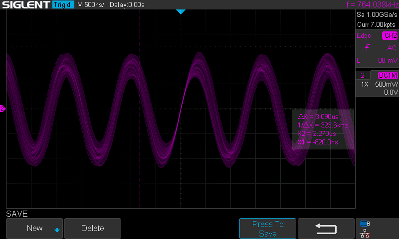
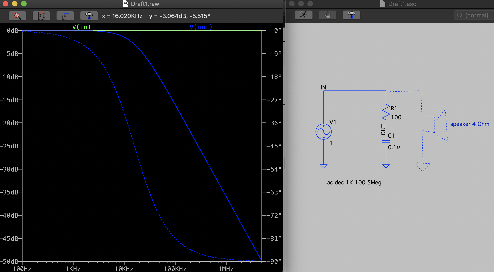

# weirdTone
## A project to understand the weird noise tone from my stereo

Suddenly a weird tone started to sound out of my HiFi receiver and speaker setup.

https://github.com/user-attachments/assets/981a4032-a31b-44b6-8024-6007ced8d948

Running the recorded audio through a spectrum analysis in matlab tells us it has a frequency of round about **600 Hz**

Connecting a oscilloscope to the speaker input port revealed a strange static sine wave coming out of the receiver:

However, it can be seen that this tone is at **764 kHz** which is far beyond the maximum frequency that humans can hear.

Since this tone dominates the Oscilloscope, the FFT view is used to find the tone that can be heard.

It turns out that this tone sits at **630 Hz** as expected, and has a second harmonic at **1258 Hz**

It can be seen that the **630 Hz** tone compared to the **764 kHz** tone has significantly lower amplitude (-37 dB). In order to understand if the strong non-hearable tone is in fact the source of the weaker hearable tone a simple RC low pass filter with -3dB cutoff at 16 kHz is designed and connected in parallell to the speaker. See LT-spice image:

Now, it can be seen that the 630Hz tone is removed by the filter even though the filters cutoff freqyency is way above in frequency. This leads us to suspect that the **630 Hz** tone is somehow related to the **764 kHz** tone.

It can be seen alreayd on the first oscilloscope screenshot almost at the top of this page that there might be both some amplitude modulation and phase modulation on the **764 kHz** carrier. This is also reflected in the frequency domain, where the bandwidth of the signals seems to be some kHz. 

Since my scope cannot demodulate signals, the signal was captured with an SDR.
